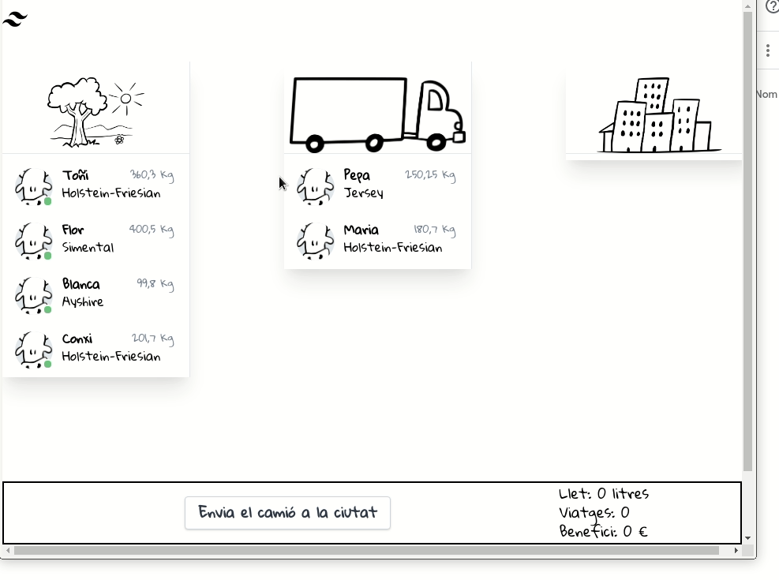

# Tests d'UI de la web de Vaques

Projecte per fer tests d'UI de la web de vaques en C#.

Encara que no ho diu (encara) el camió pot portar com a màxim 1000 kg.



Fa servir:

- Selenium
- Xunit
- Moq
- Google Chrome

## Clonar

Per clonar el projecte s'han de descarregar els mòduls. La forma més senzilla és executar:

```bash
git clone  https://github.com/fxaviersala/VaquesProject.git
```

## L'aplicació 

L'aplicació està formada per dos components un backend `VaquesBackend`  i un frontend `vaqueswasm` que li demana dades. Per tant, per tenir algun tipus d'informació els hem d'iniciar tots dos i obrir el navegador

## Tests unitaris

Fa algun test unitari de les classes internes

```bash
dotnet test  VaquesBackendTests/
```

## Tests d'interfície d'usuari

### Iniciar l'aplicació

Perquè els tests funcionin cal tenir **l'aplicació en marxa.**. Es pot fer a mà o bé amb `docker-compose`

```bash
docker-compose up -d
```
### Executar els tests

Per executar els tests d'interfície d'usuari n'hi ha prou amb `dotnet test` des del directori de tests

```bash
$ dotnet test
...
Test Run Successful.
Total tests: 7
     Passed: 7
 Total time: 26,2306 Seconds
```

O des de l'arrel especifiquem el directori del projecte

```bash
dotnet test  vaquesUiTest/
```

Els tests que fa són relativament senzills.

- Obre el navegdor i comprova que clicant a sobre d'una de les vaques es mou entre les columnes.
- Comprova que el valor del número de viatges s'incrementa

### Aturar l'aplicació

Si hem iniciat l'aplicació amb docker-compose la podem aturar amb: 

```bash
docker-compose down
```

